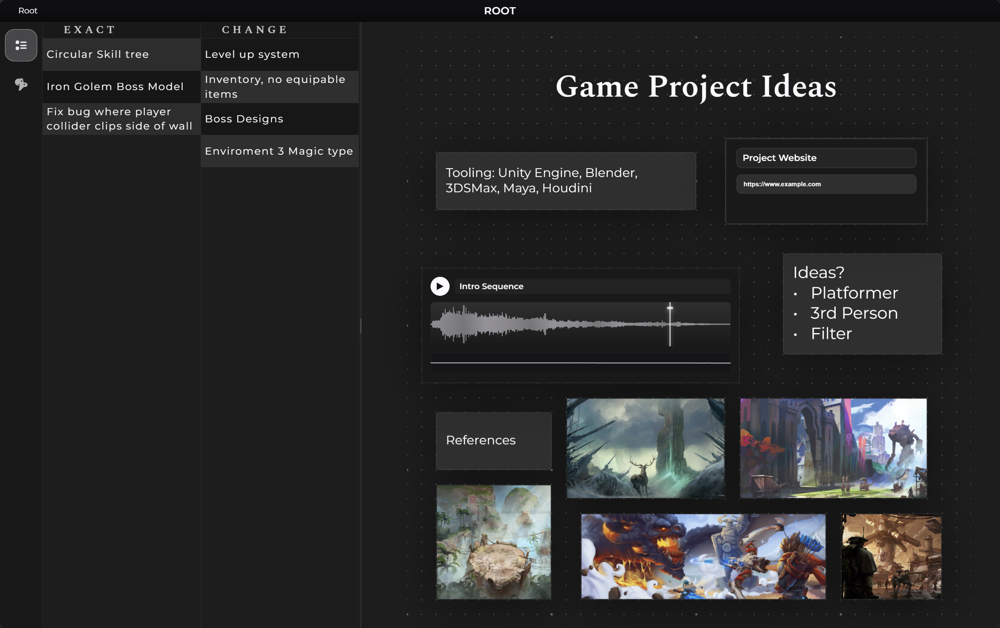
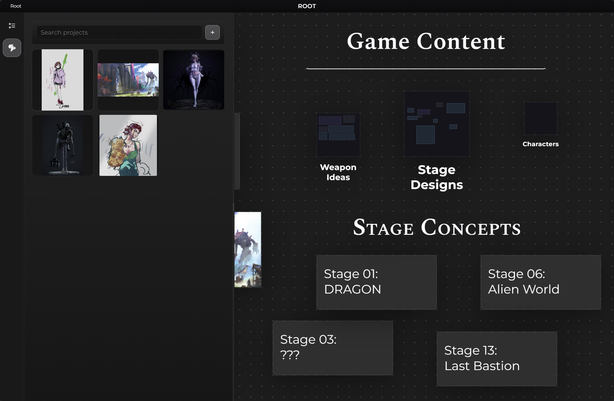
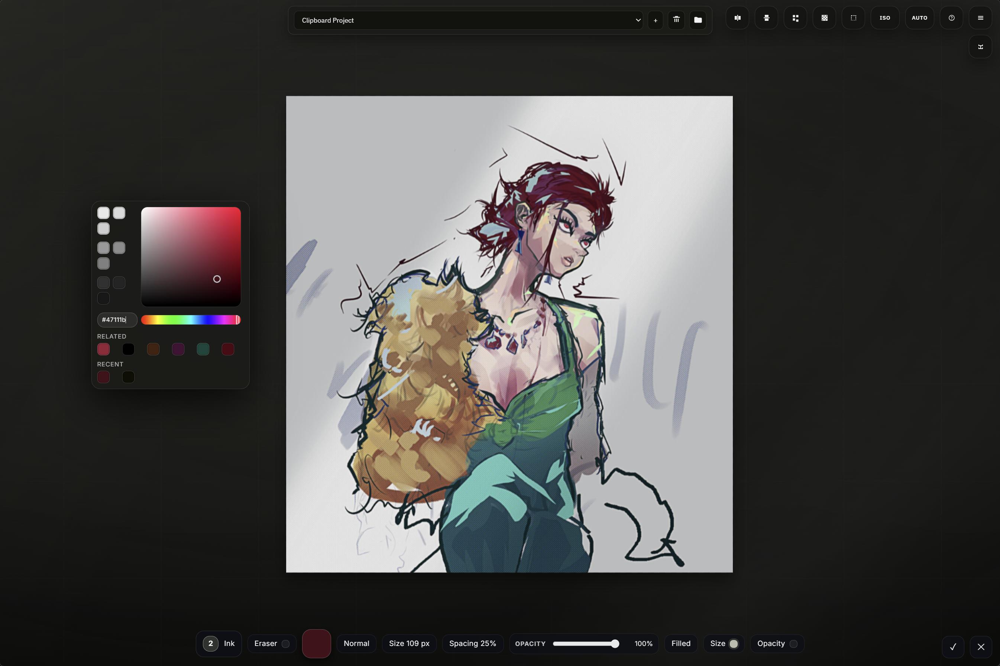

# Board Studio

A desktop board app for organizing ideas, references, and small project spaces, with a built-in painting and image editing workflow.

## Board Studio

Board Studio is the main side of the app. It is built for collecting references, structuring ideas, breaking work into nested spaces, and keeping text, images, links, audio, and video together in one place.

## Paint Studio

Paint Studio is the smaller built-in art side. It is useful for quick image edits, thumbnails, rough concept work, and simple animation or storyboard passes inside the same project flow.

## Full Details

Board Studio is still a bit rough around the edges, but it is meant to be a practical baseline that people can use, study, or extend.

In my own version, I have it hooked up to AHK and a few other utility tools for 2D art, 3D art, SFX, and music work. If you use this project, you should add and adjust things to match your own workflow.

### Main Features

#### Board Studio

- Main board workspace with nested boards
- Text, title, image, audio, video, and link blocks
- Image paste and import flow
- Board preview thumbnails
- Sublists sidebar
- 2D Art project library

#### Paint Studio

- Quick drawing and editing workflow
- Animation timeline tools
- Unity sprite sheet export helpers

### Usage

Install Node.js 18 or newer, run `npm install`, then run `npm start`.
