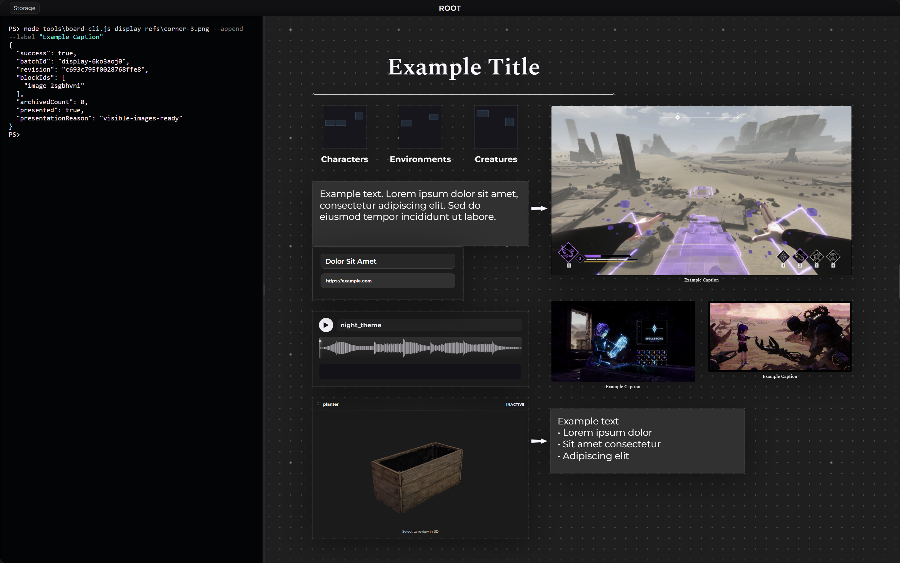
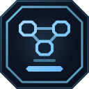

# Board Studio

A desktop board workspace I built for collecting references, organizing projects, and keeping text, images, links, audio, video and 3D models together.

There's a terminal panel on the left (`` ` `` toggles it) and a small local CLI, so AI agents or scripts can put images on a board, read what's there and move things around. `node tools/board-cli.js --help` lists the commands.

To run it, `npm install` and then `npm start`.
